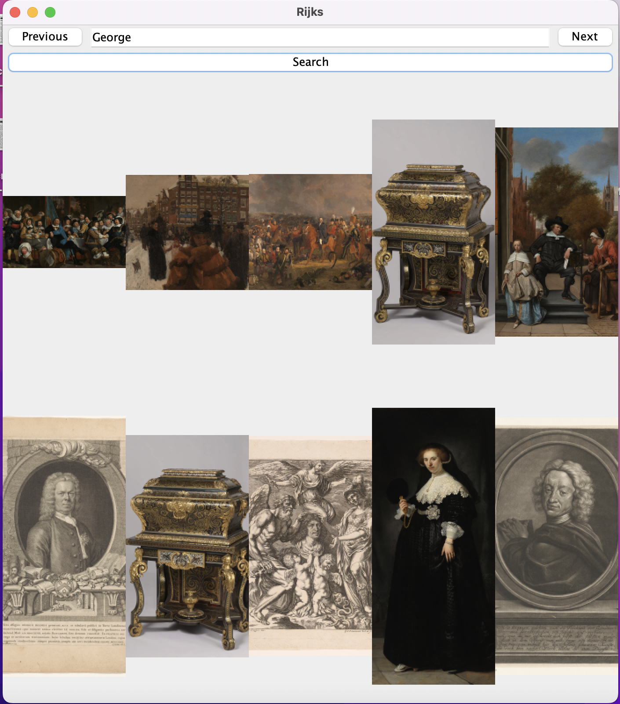
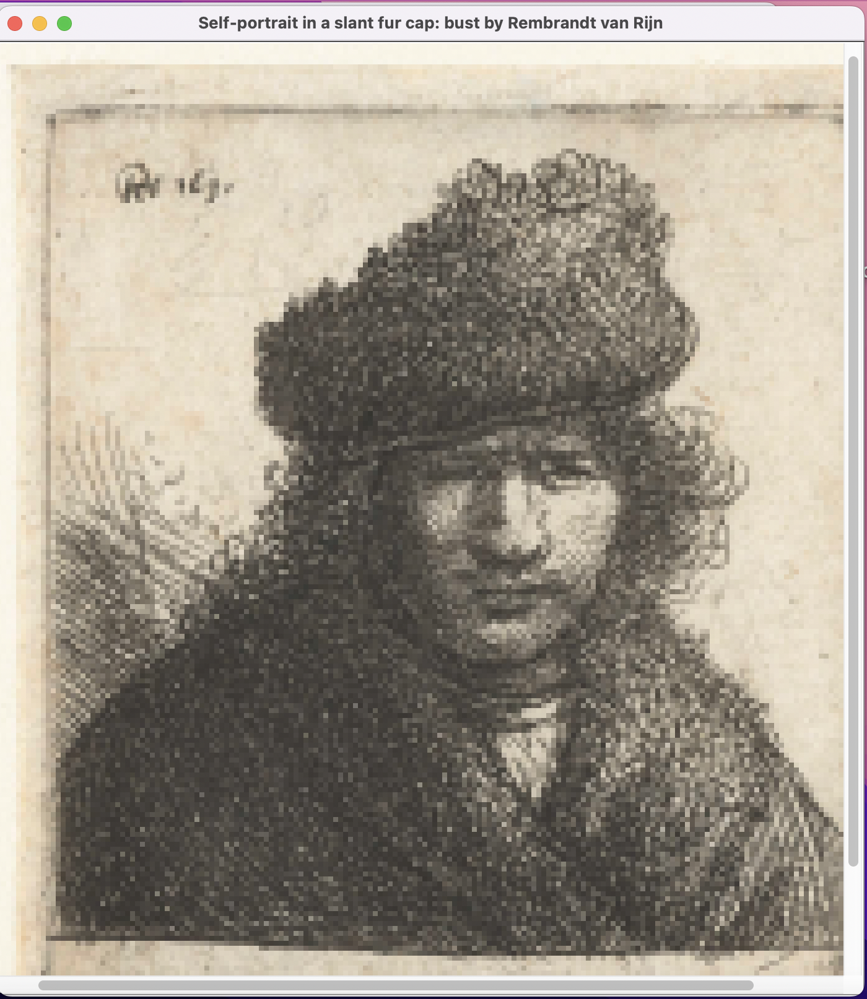

# Rijks Museum API

This project searches the Rijks Museum API and display the results
ten results are displayed per page. The previous and next buttons control 
what page number is being sent to the API. The search box is to enter a query to
send to the API. Clicking on an image will open a new frame with that image. 
There is also a tooltip to give you more information on the image by hovering 
the mouse over the image. 

